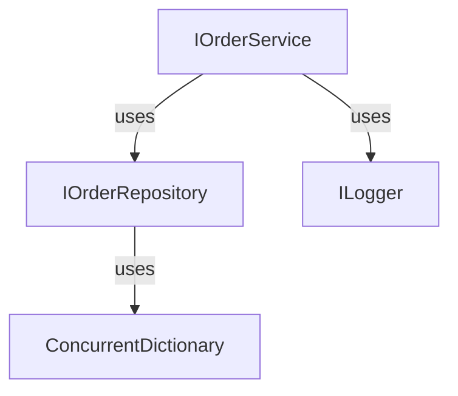

# order-processing-task

## Overview
It's just a small console-based project to demonstrate that I know concepts like Dependency Injection, basic principles of SOLID, Logging, Unit Test and async programming in .NET;

## How to run
First of all copy repository from GitHub.

### Method 1
1. Open repository in Rider
2. Double click on `orderpiece.sln`
3. Run project from IDE.
4. If you want to run test -- just select `Unit tests` from dropdown near the Run button

### Method 2
1. Open terminal in folder of the local repository copy
2. To run main project: `dotnet run --project OrderConsoleApp\OrderConsoleApp.csproj`
3. To run unit tests: `dotnet test`

## Architecture 
It's just an onion

## List of completed bonus tasks
- Asynchronous Processing
- Unit Tests